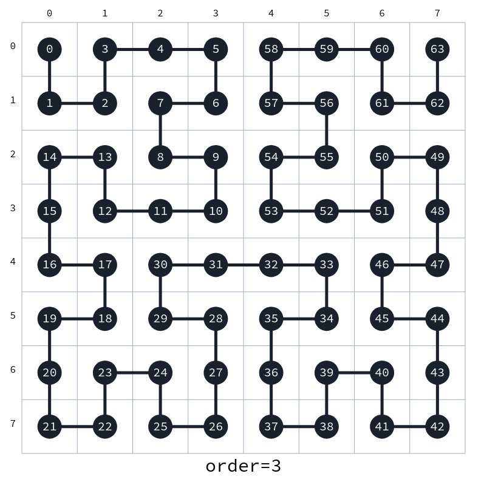

# Hilbert curve mapping

## Installation

```bash
npm install hilbert-curve
```

## Usage

Node:

```javascript
const hilbertCurve = require("hilbert-curve");

// or

import * as hilbertCurve from "hilbert-curve";
```

Browser:

```html
<!-- unpkg -->
<script src="https://unpkg.com/hilbert-curve"></script>

<!-- jsdelivr -->
<script src="https://cdn.jsdelivr.net/npm/hilbert-curve"></script>
```



### `hilbertCurve.indexToPoint(i, o)`

Given an index `i`, return the point on the Hilbert curve of order `o`
(the length of the entire curve being `2^o * 2^o`), e.g.

```javascript
// order is 3, i.e. curve is defined on a 2^3 * 2^3 = 8 * 8 square
hilbertCurve.indexToPoint(17, 3);
// { x: 1, y: 4 }
```

### `hilbertCurve.pointToIndex({x, y}, o)`

Inverse: given a point `{x,y}` on the Hilbert curve of order `o`, return the index, e.g.

```javascript
hilbertCurve.pointToIndex({ x: 5, y: 2 }, 3);
// 55
```

### `hilbertCurve.construct(data, o)`

Construct the Hilbert curve of order `o` from `data`, e.g.

```javascript
// data is `[1, 2, 3, ..., 14, 15, 16]`
const data = Array.from({ length: 4 * 4 }, (_, i) => i + 1);
hilbertCurve.construct(data, 2);
// [1, 2, 15, 16, 4, 3, 14, 13, 5, 8, 9, 12, 6, 7, 10, 11]
```

[Try `hilbert-curve` in your browser.](https://npm.runkit.com/hilbert-curve)
